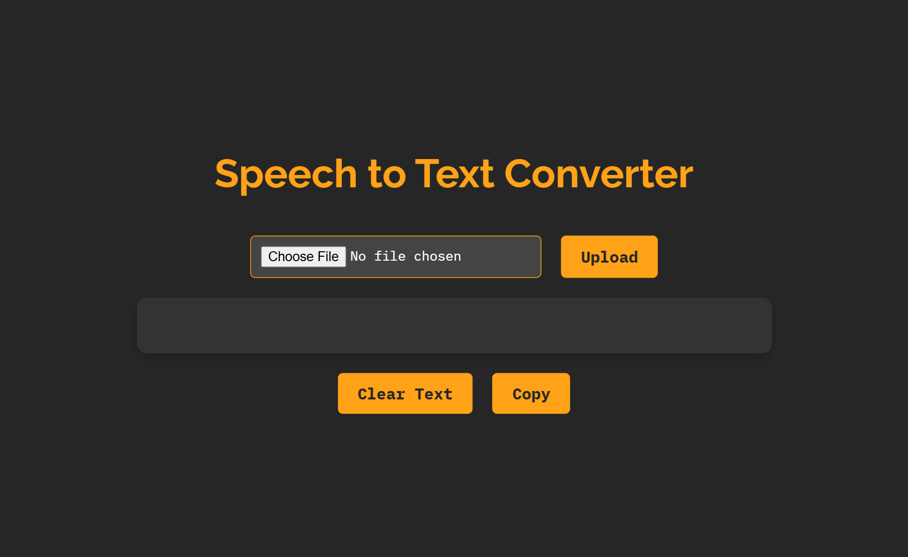
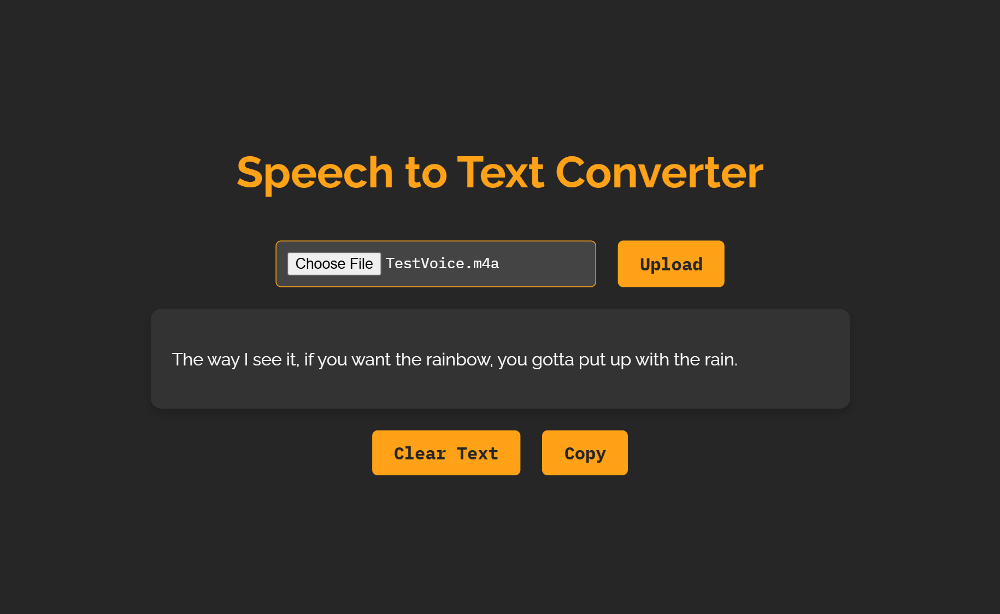

# Local STT (Speech-to-Text) Converter 
[](LICENSE)

<details>
    <summary>Table of Contents</summary>
    <ul>
        <li><a href="#about-the-project">About the Project</a></li>
        <ul>
            <li><a href="#screenshot">Screenshot</a></li>
            <li><a href="#built-with">Built with</a></li>
        </ul>
        <li><a href="#getting-started">Getting Started</a></li>
        <ul>
            <li><a href="#project-structure">Project Structure</a></li>
            <li><a href="#configuration">Configuration</a></li>
            <uk>
                <li><a href="#python-version">Python Version</a></li>
                <li><a href="#whisper-model">Whisper Model</a></li>
            </uk>
            <li><a href="#installation">Installation</a></li>
            <ul>
                <li><a href="#setup-environment-for-whisper-ai-model">Setup Environment for Whisper AI Model</a></li>
                <li><a href="#project-installation-and-testing">Project Installation and Testing</a></li>
            </ul>
        </ul>
        <li><a href="#usage">Usage</a></li>
        <li><a href="#contact">Contact</a></li>
        <li><a href="#acknowledgements">Acknowledgements</a></li>
        <li><a href="#license">LICENSE</a></li>
    </ul>
</details>

## About the Project
A simple local speech-to-text converter using [Whisper AI Model](https://github.com/openai/whisper) which is an open-source model developed by [OpenAI](https://openai.com/). <br>This converter allows you to upload audio files and get the transcription text in the webpage.

### Screenshot
- Landing Page

- Transcription


### Built with
Tech Stack used in the project.<br>
- [](https://www.python.org/)
- 
- 
- 
- 
- 
- 

## Getting Started
### Project Structure
```plaintext
local_STT_converter/
├── assets/              # Storing images
│   ├── demo.png
│   ├── stt_logo.ico
│   └── transcription.png
├── static/
│   ├── script.js        # Handling file uploads and API request
│   └── style.css        # Styling web interface
├── templates/
│   └── index.html       # Structure for web interface
├── app.py               # Main Flask application file
├── README.md               
├── requirements.txt     # List dependencies
└── LICENSE              # License Information
```
### Configuration
#### Python Version
- Recommend **Python** Version between **3.8** and **3.11**
- Whisper AI model works well with this version range and ensure the compatibility and performance of the system. 
#### Whisper Model
Whisper model used in the system is **tiny**. But there are more model that you can use.

Change Whisper model in `app.py`
```python
model = whisper.load_model("tiny")
```

Check out: [Whisper Repo](https://github.com/openai/whisper)
### Installation
#### Setup Environment for Whisper AI Model
1. **Python3.9**: Perform Whisper program
Add Python to **path** after installing
Download: [Python](https://www.python.org/downloads/)

2. **Git**: For install Whisper from GitHub Repository
Download: [Git](https://git-scm.com/)

3. **Whisper**: Whisper has not site to install, all files are store in GitHub repository . So, you need to install it from GitHub by running the following command
```bash
pip instlal git+https://github.com/openai/whisper.git
```

4. **Rust**: Use for certain dependencies which is Pytorch that is required for Whisper
Download: [Rust](https://www.rust-lang.org/)

5. **Pytorch**: A deep learning library for model execution. Version recommend for the project is 2.6.0
```bash
pip install torch==2.6.0
```
Or you can install it from [Pytorch](https://pytorch.org/). Choose an appropriate configuration then copy the command to run in terminal.

6. **FFmpeg**: Convert audio into format that is needed for Whisper
Download: [FFmpeg](https://www.ffmpeg.org/)

If you want to run Whisper on your local system. Install the specified components. Then run this code in Python File
```python
import whisper

model = whisper.load_model("turbo") # Whisper Model
result = model.transcribe("audio.mp3") # Path to Audio
print(result["text"])
```

#### Project Installation and Testing
This STT project is a local system, so you need to setup your local environment and run it.

1. **Clone Repository**
Choose a directory you want to store the Repo and run the below code in terminal.
```bash
git clone https://github.com/Leangchhay1523/local_STT_converter
cd local_STT_converter
```

2. **Setup Virtual Environment**
```bash
python -m venv venv
venv\Scripts\activate
```

3. **Install Dependencies**
Dependencies needed are specified in `requirements.txt`. Run following command
```bash
pip install -r requirements.txt
```

4. **Run the application**
```bash
python app.py
```

5. **Access Application**
Search for `http://127.0.0.1:5500/` in your browser.

**Note**: 
- Do not use `Live Server` extension in VSCode to run HTML file.
- Dont't forget to change the template of `index.html` in `templates` to `HTML`.

## Usage
1. **Upload Audio File**
- Click `Choose File` then upload the audio file. 
- Support formats include `.wav`, `.mp3`, etc.

2. **Transcribe the Audio**
- Click `Upload` and wait for the system to transcribe the audio

3. **Output**
- Wait for a moment (Depend on the duration of the audio file). If you want a long audio file, you can try large Whisper model.
- Click `Copy` to copy the transcription text.
- Click `Clear Text` to clear the output.

## Contact
If you have any questions, feel free to reach out
- **Email:** kimleangchhay.song.321@gmail.com
- **GitHub:** [Leangchhay1523](https://github.com/Leangchhay1523)

## Acknowledgements
- **Whisper AI:** This project uses the [Whisper AI model](https://github.com/openai/whisper) developed by OpenAI.
- **Flask Framework:** Built using the [Flask](https://flask.palletsprojects.com/) web framework.

## License
This project is licensed under the MIT License. See the [LICENSE](LICENSE) file for details.

<br>Feel free to explore and design your own interface for the system.


